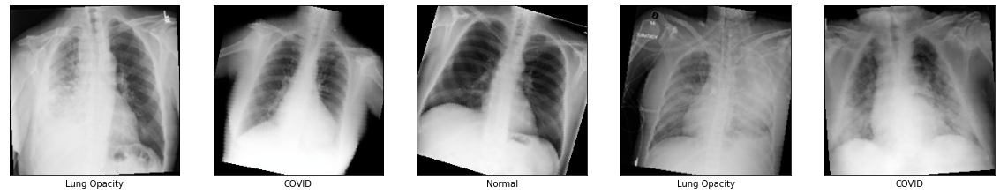
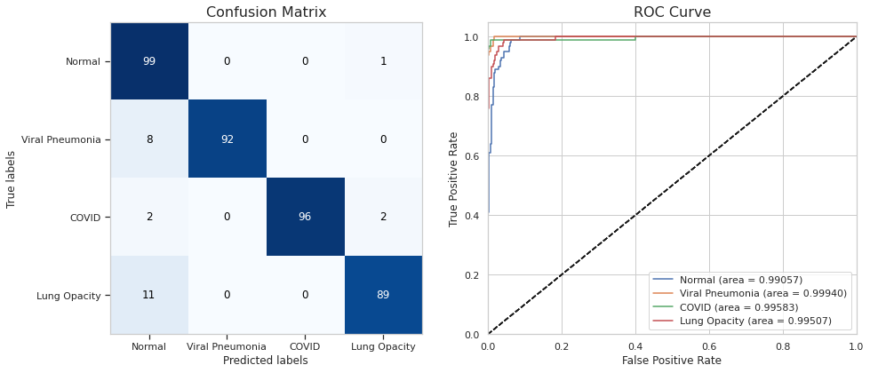
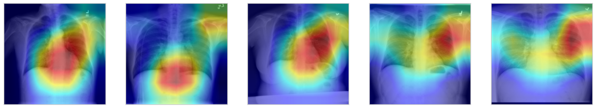

# Detecting Respiratry Diseses with Chest X-Ray

This project applies deep learning to medical image processing, aiming to build an accurate model that identifies COVID-19 infection in radiology images. Using transfer learning with a Residual Network, fine-tuned the model on real chest X-ray images of COVID-19 cases, healthy lungs, viral pneumonia, and bacterial pneumonia. The model classifies chest X-ray images into one of four classes: Normal, Viral Pneumonia, Lung Opacity (bacterial pneumonia), and COVID-19. Evaluated on 400 real test subjects, it achieved an impressive 95% overall accuracy.

## Project Highlights

- **Four-Class Classification**: The model distinguishes between Normal, COVID-19, Viral Pneumonia, and Lung Opacity (Bacterial Pneumonia) cases.
- **High Accuracy**: Achieved 95% accuracy and an AUC score of 0.98.
- **Interactive Flask App**: Developed a Flask app where users can upload a chest X-ray image, view predictions, and explore prediction metrics.

## Installation
1. Clone this repository and navigate to the project directory.
2. Install the required packages:
   ```bash
   pip install -r requirements.txt
   ```

## Dataset

This project uses the [COVID-19 Radiography Database](https://www.kaggle.com/tawsifurrahman/covid19-radiography-database) from Kaggle. 
The dataset includes:
- 3,616 COVID-19 cases
- 10,192 Normal (healthy) images
- 6,012 Lung Opacity (bacterial pneumonia) cases
- 1,345 Viral Pneumonia cases

The data was randomly split into training, validation (400 images), and test sets (400 images) without overlap.

| Class           | Description |
|-----------------|-------------|
| `COVID-19`      | X-rays of confirmed COVID-19 positive patients. |
| `Normal`        | X-rays of healthy lungs with no infection or disease. |
| `Viral Pneumonia` | Lung infection due to viral illnesses such as influenza, measles, or respiratory syncytial virus. |
| `Lung Opacity`  | Bacterial pneumonia characterized by opaque lung areas caused by known pathogens. |

## Model Training and Results

#### Data Augmentation
To enhance model generalization and prevent overfitting, applied data augmentation on the training images. 
Examples of augmented images are shown below:


#### Evaluation
The model was evaluated on 400 randomly selected test images, achieving:
- **Accuracy**: 95%
- **AUC Score**: 0.98



#### Grad-CAM Visualization
To improve interpretability, I used Grad-CAM for visual explanations. The heatmaps highlight the regions in X-ray images where the model focuses to make predictions.


## Model and Flask App

- **Model Storage**: The trained model is saved in the project directory as a `.pth` file.
- **Flask App**: The app allows users to upload an X-ray image and view the predicted classification, along with metrics. 

Run the Flask app in the project directory to test the model interactively.

## References

This project builds on various resources and research in the field:
- [DeepCOVID](https://github.com/shervinmin/DeepCovid): Transfer learning for COVID-19 X-ray classification
- [Automated Abnormality Classification of Chest Radiographs](https://www.nature.com/articles/s41746-020-0273-z.pdf)
